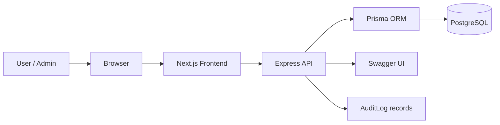
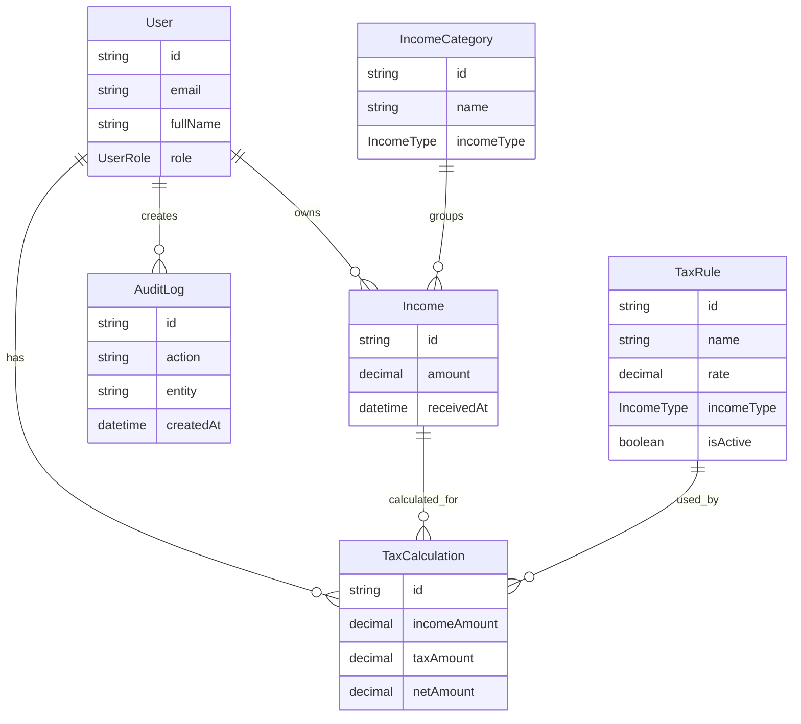
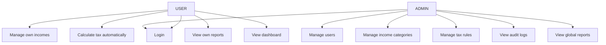
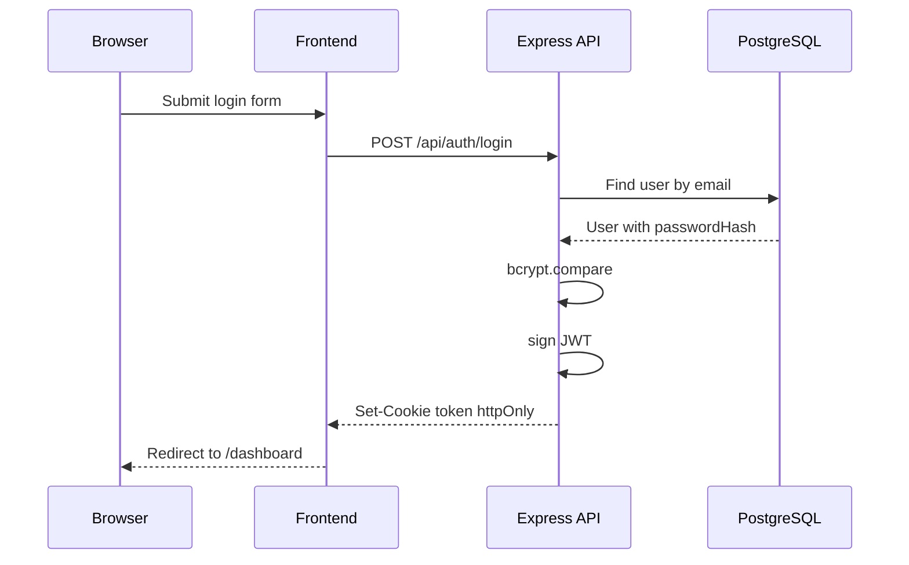
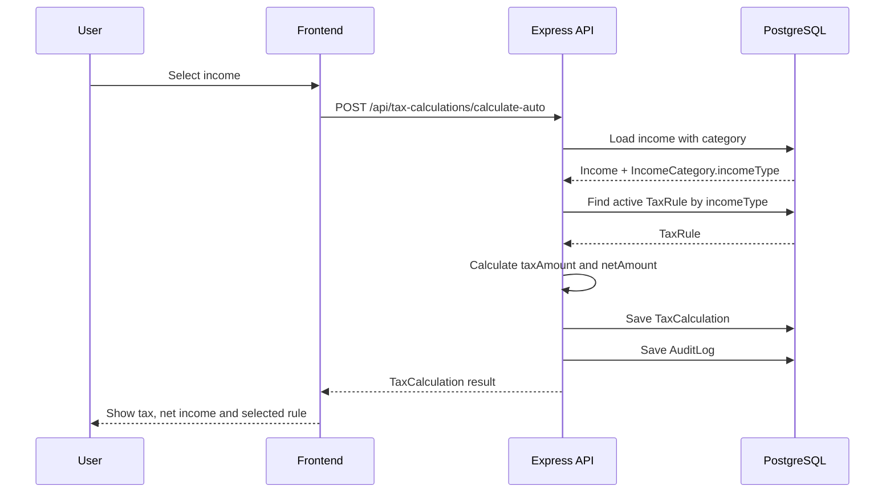

# Diagrams

## System architecture diagram

```mermaid
flowchart LR
  User["User / Admin"] --> Browser["Browser"]
  Browser --> Frontend["Next.js Frontend"]
  Frontend --> Api["Express API"]
  Api --> Prisma["Prisma ORM"]
  Prisma --> Db[("PostgreSQL")]
  Api --> Swagger["Swagger UI"]
  Api --> Audit["AuditLog records"]
```

## ER diagram simplified

```mermaid
erDiagram
  User ||--o{ Income : owns
  User ||--o{ TaxCalculation : has
  User ||--o{ AuditLog : creates
  IncomeCategory ||--o{ Income : groups
  Income ||--o{ TaxCalculation : calculated_for
  TaxRule ||--o{ TaxCalculation : used_by

  User {
    string id
    string email
    string fullName
    UserRole role
  }

  IncomeCategory {
    string id
    string name
    IncomeType incomeType
  }

  Income {
    string id
    decimal amount
    datetime receivedAt
  }

  TaxRule {
    string id
    string name
    decimal rate
    IncomeType incomeType
    boolean isActive
  }

  TaxCalculation {
    string id
    decimal incomeAmount
    decimal taxAmount
    decimal netAmount
  }

  AuditLog {
    string id
    string action
    string entity
    datetime createdAt
  }
```

## Use case diagram

```mermaid
flowchart TB
  User["USER"] --> Login["Login"]
  User --> ManageIncomes["Manage own incomes"]
  User --> CalculateTax["Calculate tax automatically"]
  User --> ViewReports["View own reports"]
  User --> ViewDashboard["View dashboard"]

  Admin["ADMIN"] --> Login
  Admin --> ManageUsers["Manage users"]
  Admin --> ManageCategories["Manage income categories"]
  Admin --> ManageRules["Manage tax rules"]
  Admin --> ViewAudit["View audit logs"]
  Admin --> ViewReportsAll["View global reports"]
```

## Auth sequence diagram

```mermaid
sequenceDiagram
  participant B as Browser
  participant F as Frontend
  participant A as Express API
  participant D as PostgreSQL

  B->>F: Submit login form
  F->>A: POST /api/auth/login
  A->>D: Find user by email
  D-->>A: User with passwordHash
  A->>A: bcrypt.compare
  A->>A: sign JWT
  A-->>F: Set-Cookie token httpOnly
  F-->>B: Redirect to /dashboard
```

## Automatic tax calculation sequence diagram

```mermaid
sequenceDiagram
  participant U as User
  participant F as Frontend
  participant A as Express API
  participant D as PostgreSQL

  U->>F: Select income
  F->>A: POST /api/tax-calculations/calculate-auto
  A->>D: Load income with category
  D-->>A: Income + IncomeCategory.incomeType
  A->>D: Find active TaxRule by incomeType
  D-->>A: TaxRule
  A->>A: Calculate taxAmount and netAmount
  A->>D: Save TaxCalculation
  A->>D: Save AuditLog
  A-->>F: TaxCalculation result
  F-->>U: Show tax, net income and selected rule
```
